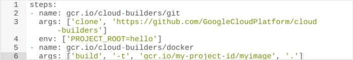

# 理解度チェック

## 理解度チェック: Google Cloud とは

1. クラウド コンピューティング リソースをスケールアップ / スケールダウンする機能の説明として正しい記述は次のうちどれですか。

クラウド コンピューティングにはリソースをスケールする方法がない。

check
CPU、メモリ、ストレージ リソースに弾力性がある。

ストレージ リソースにのみ弾力性がある。

CPU とメモリリソースにのみ弾力性がある。

2. 次のクラウド コンピューティング サービスのうち、コンピューティング、ストレージ、ネットワークの各リソースを未加工のまま、物理データセンターで構築されるような形で提供するものはどれですか。

Database as a service

check
Infrastructure as a Service

Software as a service

Platform as a Service

3. 仮想マシンなどのクラウド リソースの秒単位課金は、どのようなお客様に特に適していますか。

作成する仮想マシンで商用ライセンスが付与されたオペレーティング システムを実行するお客様。

check
多くの仮想マシンを作成して実行するお客様。

作成する仮想マシンの数が割引の対象となる数に満たないお客様。

多くの仮想マシンを作成し、数か月にわたり実行したままにするお客様。

4. 次のクラウド コンピューティング サービスのうち、アプリケーション コードをライブラリにバインドすることで、アプリケーションが必要とするインフラストラクチャにアクセスできるようにするものはどれですか。

ハイブリッド クラウド

仮想化されたデータセンター

check
Platform as a service

Software as a Service

Infrastructure as a service

5. Google Cloud のお客様が 1 つのリージョン内の複数のゾーンでリソースを使用している場合、どのようなことが考えられますか。

他のゾーンについて割引を受けるため。

check
よりフォールト トレラントにするため。

新しいエリアのお客様向けにサービスを拡張するため。

パフォーマンスを高めるため。

6. クラウド コンピューティングの基本的な特徴を次のリストから 2 つ選択してください。

お客様は複数年の契約を確約する必要がある。

プロバイダは必ずお客様ごとに専用の物理リソースを用意する。

check
ネットワーク経由でどこからでもリソースを使用できる。

すべてのリソースがオープンソースである。

check
お客様がリソースの使用量をスケールアップ、スケールダウンできる。

## 理解度チェック: クラウドにおけるリソースとアクセス

1. IAM の基本ロールと事前定義されたロールの違いは何ですか。

基本ロールは、Google Cloud プロジェクトのすべてのリソースに影響する。事前定義されたロールは、プロジェクト内の特定のサービスに適用される。

基本ロールは Google Cloud プロジェクトの所有者にのみ適用される。事前定義されたロールはどのユーザーにも関連付けることができる。

基本ロールは個々のユーザーにのみ付与できる。事前定義されたロールはグループに関連付けることができる。

基本ロールで許可されるのは、リソースの表示、作成、削除のみである。事前定義されたロールでは、あらゆる変更が許可される。

2. 会社に 2 つの Google Cloud プロジェクトがあり、この 2 つのプロジェクト間でポリシーを共有する必要があるとします。プロジェクト間の共有を設定する方法としてエラーが最も起こりにくいもの次のうちはどれですか。

一方のプロジェクトのすべてのポリシーをもう一方のプロジェクトに複製する。

両方のプロジェクトで使用する共通リソースに共有リソース ポリシーを作成する。

組織ノードに新しい共有ポリシーを定義する。

check
両方のプロジェクトを同じフォルダに格納して、そのフォルダにポリシーを定義する。

3. Google Cloud にアクセスする方法のうち、自分で記述したコードでサービスを制御できるものはどれですか。

Cloud コンソール

check
API

Cloud コンソール モバイルアプリ

Google Cloud SDK と Cloud Shell

4. 単一の Google Cloud リソース階層があるとします。考えられる状況は次のうちどれですか。3 つ選択してください。

複数の組織ノードがある。

check
組織ノードもフォルダもない。

check
組織ノードはあるが、フォルダはない。

check
組織ノードがあり、1 つ以上のフォルダがある。

組織ノードはないが、1 つ以上のフォルダがある。

5. リソース階層は IAM ポリシーの継承方法をどのように制御しますか。

リソース階層の上位で実装された IAM ポリシーは、下位のポリシーで付与されたアクセス権を取り消す。

IAM ポリシーはプロジェクト レベルでのみ実装され、リソース階層の下位で修正することはできない。

check
下位のポリシーで実装された IAM ポリシーは、上位で定義されたポリシーを上書きできる。

6. IAM ロールを一般的なものから具体的なものの順に並べた選択肢を選択してください。

check
基本ロール、事前定義されたロール、カスタムロール

事前定義されたロール、カスタムロール、基本ロール

カスタムロール、事前定義されたロール、基本ロール

7. Google Cloud リソースがリソース階層に関連付けられる方法を最もよく表している記述は次のうちどれですか。

check
すべての Google Cloud リソースはプロジェクトに関連付けられている。

すべての Google Cloud リソースは組織に関連付けられている。

Google Cloud リソースはリソース階層に関連付けられていない。

すべての Google Cloud リソースはフォルダに関連付けられている。

8. どのような場合に組織ノードを使用しますか。2 つ選択してください。

check
フォルダを作成する場合。
正解です。フォルダを扱う際は組織ノードが必要になります。

check
組織全体のポリシーを一元的に適用する場合。
正解です。組織ノードを使用すると、ポリシーを一元的に適用できます。

例外なく、組織ノードは常に必要である。

リソースをプロジェクトに整理する場合.

## 理解度チェック: クラウドにおける仮想マシンとネットワーク

1. サービスレベル契約（SLA）の対象となる相互接続オプションは次のうちどれですか。

Cloud Router を使用する VPN

check
Dedicated Interconnect

キャリア ピアリング

ダイレクト ピアリング

2. Compute Engine 仮想マシンで実行されるアプリケーションには、高パフォーマンスの一時領域が必要になります。この要件を満たすストレージの種類は次のうちどれですか。

標準永続ディスク

check
ローカル SSD

ローカル標準ディスク

SSD 永続ディスク

3. パブリック クラウド内にホストされている個別の安全なプライベート クラウド コンピューティング モデルを説明している用語は次のうちどれですか。

バーチャル プライベート ネットワーク（VPN）

check
Virtual Private Cloud（VPC）

Cloud DNS

Cloud CDN

4. Google VPC ネットワークとサブネットの説明として正しい記述は次のうちどれですか。

ネットワークとサブネットのどちらもグローバル リソースである。

check
ネットワークはグローバル リソースで、サブネットはリージョン リソースである。

ネットワークはグローバル リソースで、サブネットはゾーンリソースである。

ネットワークはリージョン リソースで、サブネットはゾーンリソースである。

5. VPC のルーターとファイアウォールに関する説明として正しい記述は次のうちどれですか。

お客様が仮想マシンをプロビジョニングし、その仮想マシン内でルーターとファイアウォールを実行する。

check
組み込み機能として Google が管理する。

仮想マシン内で Google が管理し、お客様は一切変更できない。

仮想マシン内で Google が管理するが、調整や無効化はお客様が行う。

6. プリエンプティブル VM は、標準の Compute Engine VM よりも多くの利点があります。お客様がプリエンプティブル VM を選ぶ理由は何ですか。

check
費用をおさえるため

パフォーマンスを高めるため

プレミアム オペレーティング システムにかかる費用をおさえるため

カスタム マシンタイプを使用するため

7. Google Cloud をご利用のお客様が、多層アプリケーションの一部を構成する複数のバックエンド VM 間でトラフィックをロードバランスしたいと考えています。このお客様は、ロード バランシング オプションとして次のどれを選択するべきですか。

check
リージョン内部ロードバランサ

リージョナル ロードバランサ

グローバル TCP プロキシ

グローバル SSL プロキシ

グローバル HTTP(S) ロードバランサ

## 理解度チェック: クラウドのストレージ

1. より大規模なサイズにスケールできるデータベース サービスは次のうちどれですか。

Cloud Bigtable

check
Cloud Spanner

Cloud SQL

Firestore

2. トランザクションの強整合性を保ちながらアプリケーションのデータを保存する必要があり、アプリケーションをシームレスにスケールアップしたいと考えています。このアプリケーションに最適なストレージ オプションは次のうちどれですか。

Cloud Storage

Cloud SQL

check
Cloud Spanner

Firestore

3. Firestore と Cloud Bigtable はどのような点で似ていますか。2 つ選択してください。

どちらも SQL に似たクエリを使用できる。

check
どちらも優れたスケーラビリティを備えている。
正解です。

check
どちらも NoSQL データベースである。
正解です。

どちらも 1 日の無料割り当てが設定されている。

4. センサーを搭載したデバイスを製造しており、このデバイスからクラウド内のストレージ オプションに大量のデータをストリーミングする必要があるとします。このアプリケーションに最適な Cloud Storage オプションは次のうちどれですか。

BigQuery

Firestore

check
Cloud Bigtable

Cloud Spanner

5. Cloud Storage のユースケースの説明として正しい記述は次のうちどれですか。

Cloud Storage はデータ ウェアハウス サービスを提供する。

check
Cloud Storage は、耐久性と可用性の高いオブジェクト ストレージを提供する。

Cloud Storage は Linux 仮想マシンのルート ファイル システムを提供する。

Cloud Storage は RDBMS サービスを提供する。

6. お客様が Coldline Storage クラスを検討する理由は何ですか。

セキュリティを強化するため

アクセス頻度が高いデータの保存にかかる費用を節約するため

check
アクセス頻度が低いデータの保存にかかる費用を節約するため

Coldline Storage API を使用するため

## 理解度チェック: クラウドのコンテナ

1. Kubernetes Pod とは何ですか。

クラスタのグループ

check
コンテナのグループ

ノードのグループ

VM のグループ

2. コンテナを使用してアプリケーションをデプロイする理由を 2 つ選択してください（回答を 2 つ選択してください）。

アプリケーションとオペレーティング システムを緊密に結合するため。

check
開発、テスト、本番環境に一貫性を持たせるため。
正解です。

コンテナを実行するリソースの割り当てが不要なため。

check
ワークロードの移行がシンプルなため。
正解です。

3. コンテナはどのようにしてオペレーティング システムにアクセスしますか。

check
コンテナは、共有カーネルレイヤに保存された共有ベースのオペレーティング システムを使用する。

各コンテナはオペレーティング システムの固有のインスタンスを持つ。

コンテナは、Cloud Storage バケットに保存された共有ベースのオペレーティング システムを使用する。

コンテナは、共有ランタイム レイヤに保存された共有ベースのオペレーティング システムを使用する。

4. Google Kubernetes Engine クラスタの構築に使用されるリソースは次のうちどれですか。

App Engine

check
Compute Engine

ベアメタル サーバー

Cloud Storage

5. Kubernetes クラスタとは何ですか。

アプリケーションに高可用性を提供するコンテナのグループ。

check
Kubernetes がワークロードをスケジュールできるマシンのグループ。

Kubernetes アプリケーションの管理者を管理するポッドのグループ。

6. Anthos がアプリケーションの整合性をモニタリングして維持するための豊富なツールセットを提供しているのは、次のうちどれですか。

シングルクラウド プロバイダでのみホストされるアプリケーション。

オンプレミスでのみホストされるアプリケーション。

複数のクラウド プロバイダでのみホストされるアプリケーション。

check
オンプレミス、クラウド、または複数のクラウドでホストされるアプリケーション。

7. Google Kubernetes Engine で Kubernetes を最新バージョンに保つにはどうすればよいですか。

cron ジョブを設定して、クラスタの Kubernetes バージョンを定期的に確認する必要がある。

check
Google Kubernetes Engine チームが、クラスタを新しい安定バージョンにするための自動アップグレードを定期的に実行する。

クラスタを停止して、クラスタの Kubernetes バージョンを手動で更新する必要がある。

実行中のクラスタは更新できない。更新済みの Kubernetes バージョンでクラスタのコピーを作成する必要がある。

## 理解度チェック: クラウドのアプリケーション

1. お客様向けの API でビジネス分析と課金を行うために選択すべき Google Cloud サービスは次のうちどれですか。

Cloud Endpoints

Cloud Run API

check
Apigee Edge

Compute Engine API

2. スタンダード環境と比較した場合、App Engine のフレキシブル環境にはどのような利点がありますか。3 つ選択してください。

check
アプリケーションはローカル ディスクに書き込むことができる。
正解です。

Google によってセキュリティ パッチが自動適用される。

アプリケーションがバックグラウンド スレッドでコードを実行できる。

check
SSH を使用して、アプリケーションが稼働している仮想マシンに接続できる。
正解です。

check
サードパーティ バイナリをインストールできる。
正解です。

3. Cloud Run がイメージをプルできるのは次のうちどれですか。

Docker Hub

GitHub

check
Artifact Registry

自己ホスト型レジストリ

4. ウェブ リクエストまたは Pub/Sub イベントを通じてステートレス コンテナを実行できるマネージド型のコンピューティング プラットフォームを選択してください。

Apigee Edge

Cloud Source Repositories

check
Cloud Run

Cloud Endpoints

5. App Engine の説明として正しい記述は次のうちどれですか。2 つ選択してください。

check
App Engine アプリケーションの 1 日の請求料金はゼロになることがある。
正解です。

App Engine では、リソースの使用量ではなく、事前に割り当てたリソース量に基づいて料金が請求される。

App Engine を作成するデベロッパーは、サービスを使用するために特別な方法でアプリケーションのコードを記述する必要はない。

check
App Engine は、コードの実行に必要なハードウェアとネットワーク インフラストラクチャを管理する。
正解です。

App Engine には、独自のアプリケーション ロード バランシング サービスとロギング サービスを用意するか、そのコードを記述する必要がある。

6. App Engine は、次のうちどの種類のアプリケーションの開発とホスティングに最も適していますか。

長時間実行されているバッチ処理アプリケーション。

常時稼働するインスタンスを少なくとも 1 つは必要とするアプリケーション。

check
ウェブ アプリケーション。

アプリケーションが動作しているハードウェアのフル コントロールが必要なアプリケーション。

## 理解度チェック: クラウドでの開発とデプロイ

1. 開発者がソースコードを Cloud Source Repositories に保存する理由は何ですか。2 つ選択してください。

check
作業を減らすため。
正解です。

リポジトリのソースコードにアクセスする唯一の方法であるため。

check
コードの公開を Google Cloud プロジェクトに限定するため。
正解です。

ホスティング インフラストラクチャを完全にコントロールするため。

2. Google Cloud のお客様が Terraform の使用を選択する場合、どのような理由が考えられますか。

check
Terraform は Google Cloud リソースのインフラストラクチャ管理システムとして使用できるため。

Terraform を使用すると、Google Cloud リソース上のリソース使用量と費用の上限を適用できるため。

Terraform は Kubernetes ポッドのインフラストラクチャ管理システムとして使用できるため。

Terraform は Google Cloud インフラストラクチャ レイアウトのバージョン管理システムとして使用できるため。

3. アプリケーションのイベント ドリブンなコンポーネントを Cloud Functions に組み込む利点を選択してください。

check
コンポーネントのスケーリングが Cloud Functions によってシームレスに処理されること。

Cloud Functions によって、アプリケーション イベントをトリガーするために別のサービスを使用する必要がなくなること。

Cloud Functions では、コーディングに C# と C++ を使用できること。

Cloud Functions では、常に料金がかからずに処理を実行できること。

4. Google Cloud のお客様が Cloud Functions を使用する場合、どのような理由が考えられますか。

check
アプリケーションにイベント ドリブンなコードが含まれており、そのコードの実行に必要なコンピューティング リソースのプロビジョニングを不要にするため。

従来のモノリシック構造を持つアプリケーションをマイクロサービスに分割するため。

Cloud Functions は料金なしでコンピューティング オペレーションをホストできるサービスであるため。

Cloud Functions は Google Cloud で Node.js アプリケーションを実行する基本的な方法であるため。

## 理解度チェック: クラウドにおけるロギングとモニタリング

1. システムとアプリケーションにはわずかな「ダウンタイム」しか発生しないというお客様との約束を説明している選択肢は次のうちどれですか。

重要業績評価指標

サービスレベル指標

check
サービスレベル契約

サービスレベル目標

2. サービスレベル指標（SLI）の定義を正しく説明している記述は次のうちどれですか。

重要業績評価指標（セッションごとのクリック数や顧客登録数など）。

サービスで達成しようとしている指標の目標値（%）。

check
期限が明確で測定可能なサービスの属性。

サービスのパフォーマンスに関するお客様との契約。

3. Google Cloud リソースに関するアラート（ヘルスチェックが失敗したときのアラートなど）を作成する必要があるとします。この場合に使用するのが最適な Google Cloud プロダクトは次のうちどれですか。

Cloud Functions

Cloud デバッガ

check
Cloud Monitoring

Cloud Trace

4. Cloud Logging について正しい記述を 2 つ選択してください。

Cloud Logging では、稼働時間チェックの条件を定義できる。

check
Cloud Logging では、ログに基づいて指標を定義できる。
正解です。

Cloud Logging では、サードパーティのモニタリング エージェントを使用する必要がある。

check
Cloud Logging では、アプリケーションのログを表示して、ログのフィルタと検索を行うことができる。
正解です。

Cloud Logging では、ログを BigQuery または Cloud Storage に保存する必要がある。

5. システムのパフォーマンスと信頼性を測定する「4 つのゴールデン シグナル」があります。それはどのようなものですか。

KPI、SLI、SLO、SLA

check
レイテンシ、トラフィック、飽和度、エラー

可用性、耐久性、スケーラビリティ、復元性

get、post、put、delete

## 練習問題: アプリケーションのデプロイ

1. Deployment Manager の主な用途は何ですか。

check
Deployment Manager を使用すると Google Cloud Platform インフラストラクチャを立ち上げることができ、インフラストラクチャをコードとして扱うことができます。

Deployment Manager を使用すると、マルチクラウド リソースを立ち上げることができます。

Google Cloud Platform にインフラストラクチャをデプロイする前に、Deployment Manager のテンプレートをローカルでテストできます。

Deployment Manager を使用すると、Docker イメージをビルドできます。

2. Container Builder と Container Registry は、継続的インテグレーションと継続的デリバリーのパイプラインの構築にどのように役立ちますか。3 つ選択してください。

check
Container Builder では、各ビルドステップで生成されたアーティファクトが /workspace フォルダに保持されるため、次のビルドステップで使用できます。
正解です。

check
Container Builder はフルマネージド サービスです。ビルドマシンにビルドツールとコンテナ イメージをすべてダウンロードしたり、ビルド インフラストラクチャを管理したりする必要はありません。
正解です。

リポジトリにコードを commit する際に、gcloud コマンドを使用してビルドを手動で開始する必要があります。

Container Builder を Google Kubernetes Engine にインストールすることができ、ビルド数に応じて Kubernetes Engine が自動スケーリングを行います。

check
Container Registry と Container Builder を使用すると、リポジトリにコードを commit した際に自動的にトリガーされるビルド パイプラインを作成できます。

3. 継続的インテグレーションと継続的デリバリーに関する以下の説明のうち、正しいものはどれですか。2 つ選択してください。

継続的インテグレーションと継続的デリバリーを活用するには、デベロッパーは GitHub を使用する必要があります。

check
継続的デリバリーは、変更がマスター リポジトリに push されたときにトリガーされるワークフローです。
正解です。

すべてのテストに合格すると、機能ブランチで継続的インテグレーションから生成したビルドを本番環境でリリースできます。

check
継続的インテグレーションはデベロッパー ワークフローの 1 つです。このワークフローでは、デベロッパーがソースコード リポジトリで頻繁にマスターから pull して機能ブランチに変更を commit します。
正解です。

## 最終問題: アプリケーションのデプロイ

1. 次の Deployment Manager の構成を確認してください。次の説明のうち正しいものはどれですか。3 つ選択してください。 vm.yaml

「vm_template.jinja」テンプレートは「imports」セクションですでに指定されているため、このテンプレートを「type」属性で指定することはできません。

check
このデプロイ構成によって、Google Compute Engine インスタンスが起動します。
正解です。

startup-script プロパティで指定したコードが Google Cloud Shell で実行されます。

check
「zone」プロパティがテンプレートに渡されます。
正解です。

check
ウェブサーバーが起動し、サーバー トラフィックがポート 8080 に設定されます。
正解です。

2. 次の Container Builder ビルド構成ファイルを確認してください。この構成のビルドステップを示している以下の説明のうち、正しいものはどれですか。

2 つのステップがあります。最初のステップで、cloud-builders と呼ばれるリポジトリを GitHub に作成します。2 つ目のステップで、そのリポジトリにクラウド ネイティブなアプリケーション イメージを作成します。

2 つのステップがそれぞれ独立していて、同じ作業ディレクトリを共有していないため、このビルド構成ファイルは無効です。

check
2 つのステップがあります。最初のステップで、GitHub リポジトリのクローンを作成します。2 つ目のステップで、そのリポジトリのコンテンツに基づいて Docker イメージをビルドします。

Docker では GitHub リポジトリのコンテンツをビルドできないため、このビルド構成ファイルは無効です。

3. Container Builder、Container Registry、Deployment Manager に関する以下の説明のうち、正しいものはどれですか。2 つ選択してください。

check
Cloud Container Builder と Deployment Manager を使用すると、インフラストラクチャをコードとして扱うことができます。
正解です。

複数のツールチェーンを組み合わせて併用することはできません。たとえば、Container Builder と Container Registry を Spinnaker と併用することはできません。

check
Container Builder と Container Registry を使用して継続的インテグレーションと継続的デリバリーのパイプラインを作成する場合、ビルドトリガーが役に立ちます。
正解です。

Deployment Manager を使用して、オンプレミスに仮想マシン インスタンスを設定できます。

## 練習問題: アプリケーションの実行環境

1. Cloud Dataflow で使用されているプログラミング フレームワークは次のうちどれですか。

Apache Mesos

check
Apache Beam SDK

Google Cloud SDK

Google Cloud クライアント ライブラリ

> Cloud Dataflow は、Apache Beam SDK の高機能な Java API と Python API を使用して、高速で簡素化されたパイプライン開発をサポートしています。

2. 特定のオペレーティング システム要件を持つ特殊なアプリケーションを使用するために、詳細にカスタマイズした VM が必要です。使用する実行環境として、どれを検討すべきでしょうか。

App Engine フレキシブル環境

check
Google Compute Engine

Google Kubernetes Engine

Cloud Functions

> Compute Engine では、独自のコンピューティングまたはオペレーティング システムの要件を持つ特殊なアプリケーション向けに、詳細にカスタマイズされた VM を作成できます。

3. Cloud Functions 以外の実行環境を検討すべきなのはどのようなアプリケーションですか。

check
大規模で複雑なコードベースを持つアプリケーション

> アプリケーションまたはマイクロサービスのコードベースが大規模で複雑な場合、または Node.js 以外のランタイム環境を使用する必要がある場合は、他のコンピューティング環境を検討してください。

check
Node.js 以外のプログラミング フレームワークで記述されているアプリケーション
正解です。

Node.js プログラミング フレームワークで記述されているアプリケーション

軽量マイクロサービスであるアプリケーション

## 最終問題: アプリケーションの実行環境

1. HTTP/S 以外のネットワーク プロトコルを使用するアプリケーションの一部をオンプレミスで、残りの部分をクラウドで実行します。使用する実行環境として、どれを検討すべきでしょうか。

Cloud Functions

check
Google Kubernetes Engine

Google Compute Engine

App Engine フレキシブル環境

2. アプリケーションで、並列データ処理パイプラインを実行して IoT 製造データを分析します。このアプリケーションに最適な実行環境はどれでしょうか。

Google Cloud Functions

check
Cloud Dataflow

Google Compute Engine

App Engine スタンダード

3. アプリケーションで、ユーザーがアップロードを開始するたびに画像のサムネイルを作成して保存します。使用する実行環境として、どれを検討すべきでしょうか。

check
Google Cloud Functions

Google Kubernetes Engine

Google Compute Engine

App Engine フレキシブル環境

## 練習問題: デバッグ、モニタリング、パフォーマンス調整

1. Compute Engine インスタンス上で実行されているサードパーティ アプリケーションから Cloud Logging にログをストリーミングしたいと考えています。次のどのサービスの使用を検討すべきでしょうか。

check
Cloud Logging エージェント

Error Reporting

Cloud Debugger

Cloud Trace

> Compute Engine インスタンスと Amazon EC2 インスタンスに Cloud Logging エージェントをインストールして、サードパーティ アプリケーションから Cloud Logging にログをストリーミングできます。

2. アプリケーションをモニタリングする利点は何ですか。3 つ選択してください。

必要に応じてパフォーマンス テストを作成できる。

致命的な問題の発生を防止できる。

check
結果の経時的な比較や実験的な構成間での比較を行うことができる。

> アプリケーションをモニタリングすると、パフォーマンスの長期的な傾向の分析、結果の経時的な比較や実験的な構成間での比較、機能障害の発生または発生予測によるアラートの発行、問題のアドホックなレトロスペクティブ分析を行うことができます。

check
機能障害の発生または発生予測によりアラートを発行できる。

> アプリケーションをモニタリングすると、パフォーマンスの長期的な傾向の分析、結果の経時的な比較や実験的な構成間での比較、機能障害の発生または発生予測によるアラートの発行、問題のアドホックなレトロスペクティブ分析を行うことができます。

check
パフォーマンスの長期的な傾向を分析できる。

> アプリケーションをモニタリングすると、パフォーマンスの長期的な傾向の分析、結果の経時的な比較や実験的な構成間での比較、機能障害の発生または発生予測によるアラートの発行、問題のアドホックなレトロスペクティブ分析を行うことができます。

3. ユーザーのアプリケーションでエラーが発生しました。あなたは、スタック トレースでエラーが発生した場所を特定したいと考えています。エラーを確認するのに役立つサービスはどれですか。

Cloud Logging

check
Error Reporting

Cloud Monitoring

Cloud Trace

> Error Reporting には、アプリケーションで発生したエラーが表示されます。スタック トレースを確認して、エラーが発生している場所を特定できます。

## 最終問題: デバッグ、モニタリング、パフォーマンス調整

1. ミッションクリティカルなアプリケーションのモニタリングを設定する場合、ダッシュボードでどのようなシグナルをモニタリングする必要がありますか。

check
飽和度、レイテンシ、トラフィック、エラー

飽和度、レイテンシ、スロットリング、エラー

セキュリティ、レイテンシ、スロットリング、エラー

コントラスト、レイテンシ、トラフィック、エラー

2. Cloud Datastore と Cloud Pub/Sub に gRPC 呼び出しを連続して実行できる。

Cloud Datastore と Cloud Pub/Sub に gRPC 呼び出しを連続して実行できる。

check
Cloud Datastore と Cloud Pub/Sub に gRPC 呼び出しを並列に実行できる。

Cloud Datastore と Cloud Pub/Sub に、gRPC API ではなく REST API を使用できる。

個々の注文に応じてクエリを実行するのではなく、バッチ オペレーションでデータにクエリを実行できる。

3. いくつかのマイナー リリースの後、本番環境でアプリケーションの一部の機能が以前より遅くなったようです。リリース サイクルの早い段階でパフォーマンスの問題を検出するための最適な方法はどれですか。

時間的制約のあるコードに変更を加えないようにする。

CPU リソースとメモリリソースの追加を計画する。

check
テストスイートにパフォーマンス テストを追加する。

新しいコードの周囲に時間の測定を追加して速度低下を検出する。

